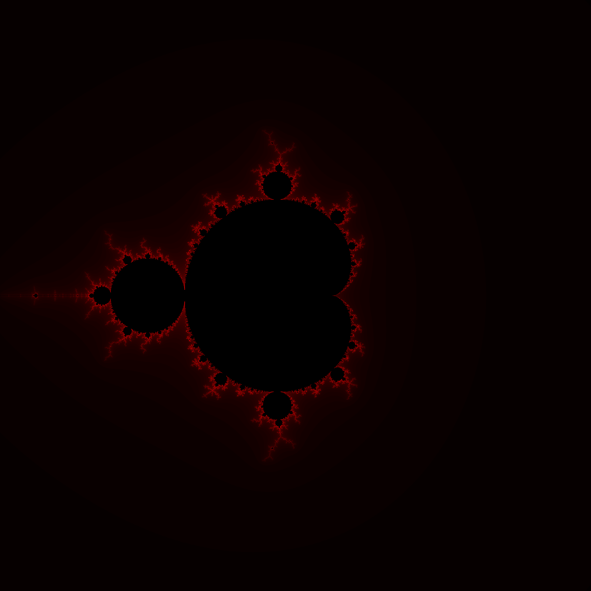
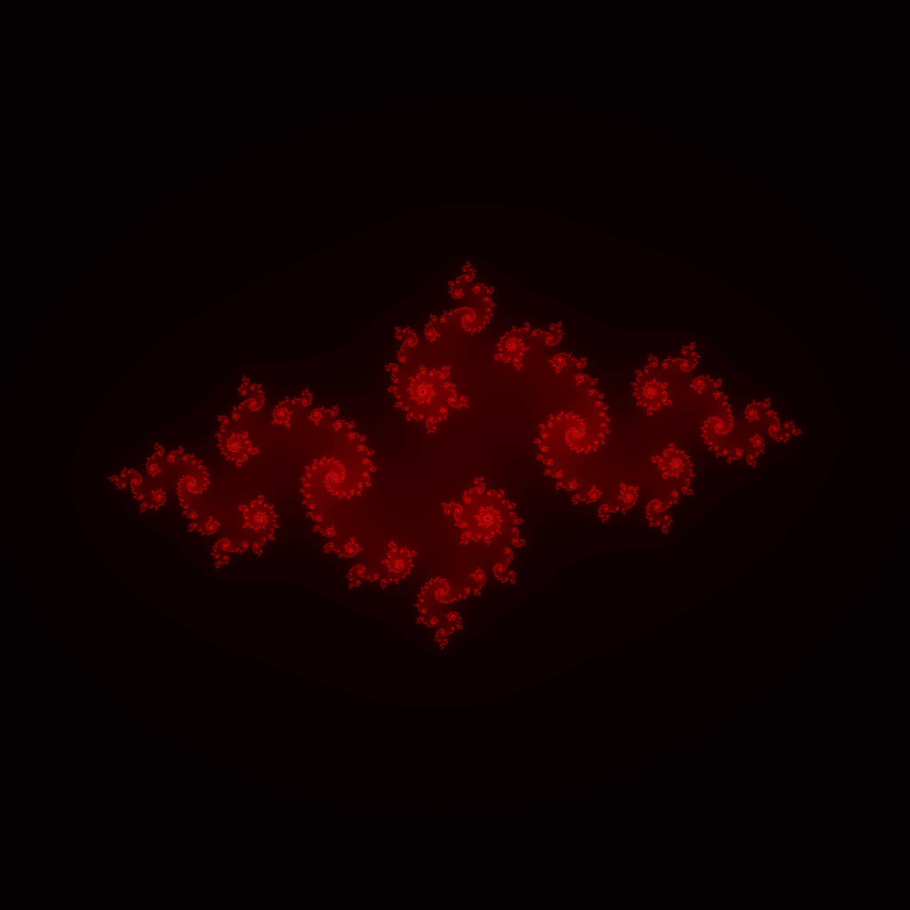

# MandelbrotSet

This is a homework project for High End Simulation Progmming course in FAU-Erlangen/Nürnberg in which we implemented a parallel programmed Mandelbrot set generator with OpenCL. The original homework is developed in Ubuntu OS with NVIDIA GPUs. However, I converted the code to run in XCode 11.4 with OpenCL 1.2 in a Intel Iris Plus Graphics 640 GPU.

  

## Notes 

- By default, the code would run with no command line arguments and generate a Mandelbrot fractal. 
- To generate different fractals, one can comment out the marked sections of code in the main file and the kernel file.

## Contributors
- Gabriel Stankiewicz
- Mohammad Moataz
